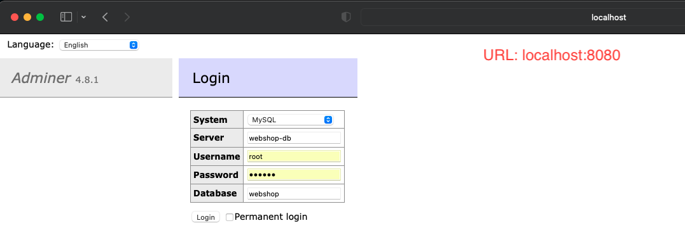

# WebShop application

A simple CLI-based shop administration tool. The application administers products and handles shopping-related
processes.

# Tech Requirements

- Java 11
- Maven 3
- Docker (optional)

# How to start

- To start the application with the default profile, please execute the following command:
  `mvn spring-boot:run`
- To start the application with the prod profile, please execute the following command:
  `mvn spring-boot:run -Dspring-boot.run.profiles=prod`

# Database

- The H2 in memory database will be set up for the default profile.
- The MySql database will be set up for the prod profile.
  1. There is a `docker-compose.yml` file in the project folder, it is for starting up a MySql server, and a phpMyAdmin
     service.
  2. To be able to use the features of Docker, you need to install the Docker on to your OS.
  3. To start the MySql server, and the phpMyAdmin service, please execute the following command: `docker-compose up`
  4. To connect to the phpMyAdmin, please visit the `localhost:8080` URL and login into the service.
     
